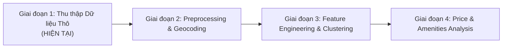
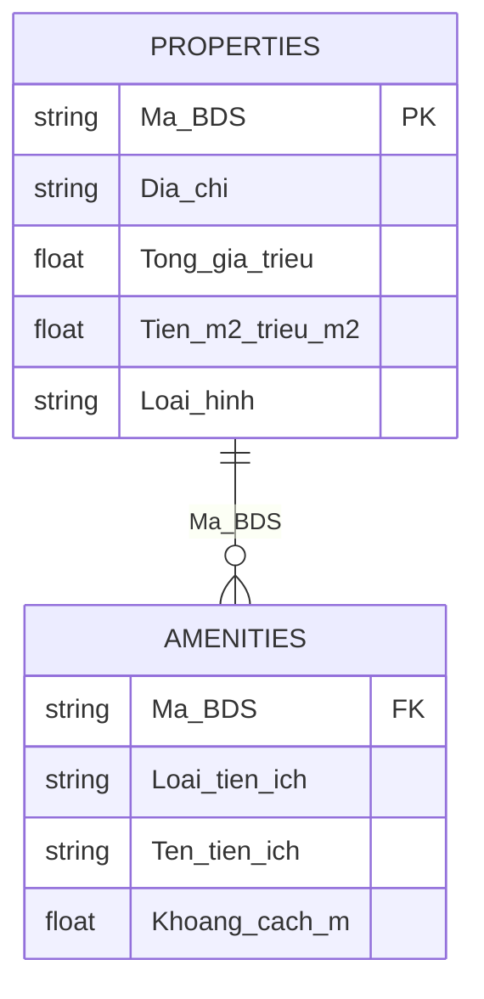

# Dự án Phân tích Ảnh hưởng của Tiện ích đến Giá Bất động sản
## 🚀 Giai đoạn 1: Thu thập và Đóng gói Dữ liệu Thô (Raw Data Collection Pipeline)

Dự án **Real Estate Amenities & Price Analysis** là nghiên cứu phân tích tác động của các tiện ích xung quanh (trường học, chợ, siêu thị, bệnh viện...) tới giá trị của các loại hình Bất động sản (BĐS) tại khu vực TP.HCM.

> [!IMPORTANT]
> **Trạng thái hiện tại của Repository:**
> Hiện tại, repository đang tập trung triển khai **Giai đoạn 1 (Phase 1): Thu thập và Đóng gói Dữ liệu Thô (Raw Data Collection)** từ nền tảng Moso.vn. Các giai đoạn làm sạch, biến đổi tọa độ, phân nhóm và mô hình hóa giá BĐS sẽ được tích hợp trong các giai đoạn tiếp theo của dự án.

---

## 📋 Mục lục

1. [Giới thiệu dự án tổng thể](#1-giới-thiệu-dự-án-tổng-thể)
2. [Mục tiêu và Lộ trình dự án](#2-mục-tiêu-và-lộ-trình-dự-án)
3. [Phạm vi Phase 1 & Tính năng chính](#3-phạm-vi-phase-1--tính-năng-chính)
4. [Cấu trúc project](#4-cấu-trúc-project)
5. [Yêu cầu môi trường](#5-yêu-cầu-môi-trường)
6. [Hướng dẫn cài đặt `uv`](#6-hướng-dẫn-cài-đặt-uv)
7. [Hướng dẫn thiết lập môi trường bằng `uv`](#7-hướng-dẫn-thiết-lập-môi-trường-bằng-uv)
8. [Hướng dẫn cài đặt dependencies bằng `uv`](#8-hướng-dẫn-cài-đặt-dependencies-bằng-uv)
9. [Hướng dẫn thêm / xóa thư viện bằng `uv`](#9-hướng-dẫn-thêm--xóa-thư-viện-bằng-uv)
10. [Hướng dẫn chạy crawler (Phase 1)](#10-hướng-dẫn-chạy-crawler-phase-1)
11. [Mô tả các CLI arguments](#11-mô-tả-các-cli-arguments)
12. [Các ví dụ chạy thực tế](#12-các-ví-dụ-chạy-thực-tế)
13. [Cấu trúc thư mục dữ liệu đầu ra](#13-cấu-trúc-thư-mục-dữ-liệu-đầu-ra)
14. [Mô tả dataset Properties (Dữ liệu BĐS thô)](#14-mô-tả-dataset-properties-dữ-liệu-bđs-thô)
15. [Mô tả dataset Amenities (Dữ liệu tiện ích thô)](#15-mô-tả-dataset-amenities-dữ-liệu-tiện-ích-thô)
16. [Quan hệ giữa Properties và Amenities](#16-quan-hệ-giữa-properties-và-amenities)
17. [Ví dụ dữ liệu thô](#17-ví-dụ-dữ-liệu-thô)
18. [Logging / output khi chạy script](#18-logging--output-khi-chạy-script)
19. [Các lưu ý khi sử dụng crawler](#19-các-lưu-ý-khi-sử-dụng-crawler)
20. [Định hướng các Phase tiếp theo (Future Work)](#20-định-hướng-các-phase-tiếp-theo-future-work)

---

## 1. Giới thiệu dự án tổng thể

Dự án **Real Estate Amenities & Price Analysis** hướng tới việc trả lời câu hỏi cốt lõi: *"Các tiện ích xung quanh (trường học, chợ, siêu thị, bệnh viện...) và khoảng cách đến chúng ảnh hưởng như thế nào đến đơn giá và tổng giá của bất động sản?"*

Để giải quyết bài toán này, dự án được chia thành nhiều giai đoạn phát triển. Hiện tại, dự án đang ở **Giai đoạn 1 (Phase 1)** với nhiệm vụ xây dựng đường ống tự động hóa thu thập toàn bộ dữ liệu thô về bất động sản và tiện ích lân cận từ nguồn Moso.vn.

---

## 2. Mục tiêu và Lộ trình dự án

Dự án được thiết kế theo lộ trình 4 giai đoạn chính:



* **Giai đoạn 1: Thu thập Dữ liệu Thô (Scope hiện tại của Repository):**
  * Crawl tự động dữ liệu BĐS tại TP.HCM theo 4 nhóm loại hình: **Nhà hẻm**, **Căn hộ chung cư**, **Đất**, **Nhà mặt tiền**.
  * Bóc tách toàn bộ danh sách các tiện ích xung quanh từng BĐS (loại tiện ích, tên, khoảng cách).
  * Lưu trữ chuẩn hóa thành 2 tập dữ liệu thô độc lập (`Properties` và `Amenities`) liên kết qua mã định danh `Ma_BDS`.
* **Giai đoạn 2: Làm sạch & Chuyển đổi Tọa độ (Data Preprocessing & Geocoding):**
  * Làm sạch dữ liệu khuyết, xử lý ngoại lệ (outliers).
  * Chuyển đổi địa chỉ BĐS thành tọa độ địa lý ($Lat, Long$).
* **Giai đoạn 3: Trích xuất Đặc trưng & Phân nhóm (Feature Engineering & Clustering):**
  * Tính khoảng cách đường chim bay đến trung tâm thành phố (Nhà thờ Đức Bà).
  * Phân nhóm (Clustering) các BĐS tương đồng nhằm kiểm soát biến số loại hình và vị trí.
* **Giai đoạn 4: Phân tích Ảnh hưởng Tiện ích lên Giá BĐS (Econometric & ML Modeling):**
  * Phân tích tương quan và xây dựng mô hình đánh giá tác động của khoảng cách/mật độ tiện ích tới giá BĐS.

---

## 3. Phạm vi Phase 1 & Tính năng chính

Trong phạm vi **Giai đoạn 1**, repository cung cấp các tính năng thu thập dữ liệu thô bao gồm:

* **Crawl đa dạng loại hình BĐS:** Cho phép cào linh hoạt từng loại hình (`alley`, `apartment`, `land`, `street`) hoặc cào tất cả (`all`).
* **Trích xuất thuộc tính chi tiết:** Tự động thu thập giá rao bán, đơn giá $/m^2$, kích thước (ngang, dài), số phòng ngủ, phòng tắm, số tầng, pháp lý, nội thất...
* **Tự động liên kết tiện ích lân cận:** Thu thập danh sách các điểm tiện ích lân cận và khoảng cách ghi nhận tương ứng với từng BĐS.
* **Chuẩn hóa giá trị số thô:** Parse đơn vị tiền tệ (triệu/tỷ VNĐ) và khoảng cách ($m/km$) về dạng số thực (`Float`) ngay ở bước cào thô.
* **Đóng gói xuất file an toàn:** Xuất kết quả CSV đính kèm timestamp (`YYYYMMDD_HHMMSS`) để không đè dữ liệu các lần cào trước.
* **Quản lý môi trường & dependencies chuẩn mực:** Sử dụng `uv` giúp khởi tạo virtual environment và quản lý package cực kỳ nhanh chóng.

---

## 4. Cấu trúc project

```text
real-estate-amenities-price-analysis/
├── data/
│   ├── raw/                     # Thư mục lưu trữ dữ liệu thô cào về từ Phase 1
│   │   ├── properties/          # Tập dữ liệu thuộc tính BĐS thô
│   │   └── amenities/           # Tập dữ liệu tiện ích thô
│   └── sample/                  # Thư mục chứa dữ liệu mẫu tham chiếu
│       ├── properties/          # Sample BĐS (alley_house, apartment, land, street_house)
│       └── amenities/           # Sample tiện ích (alley_house, apartment, land, street_house)
├── src/
│   ├── crawlers/
│   │   └── moso/
│   │       ├── __init__.py
│   │       └── run_crawler.py   # Code thực thi chính của Phase 1 (Crawl dữ liệu thô)
│       
├── .python-version              # Khai báo phiên bản Python dự án
├── .gitignore                   # Cấu hình Git ignore
├── pyproject.toml               # Cấu hình dự án & dependencies (dùng uv)
├── uv.lock                      # Lockfile của uv
└── README.md                    # Tài liệu hướng dẫn dự án
```

---

## 5. Yêu cầu môi trường

* **Hệ điều hành:** Linux, macOS, hoặc Windows.
* **Python:** `>= 3.12`
* **Package Manager:** `uv` (Fast Python package installer).

---

## 6. Hướng dẫn cài đặt `uv`

`uv` là trình quản lý gói và môi trường Python tốc độ cao. Cài đặt bằng các lệnh sau:

### Trên Linux / macOS
```bash
curl -LsSf https://astral.sh/uv/install.sh | sh
```

### Trên Windows (PowerShell)
```powershell
powershell -c "irm https://astral.sh/uv/install.ps1 | iex"
```

### Kiểm tra phiên bản `uv`:
```bash
uv --version
```

---

## 7. Hướng dẫn thiết lập môi trường bằng `uv`

1. **Clone repository:**
   ```bash
   git clone https://github.com/TruongHaiTrieu/real-estate-amenities-price-analysis.git
   cd real-estate-amenities-price-analysis
   ```

2. **Khởi tạo Virtual Environment:**
   ```bash
   uv venv
   ```
   *Môi trường ảo sẽ được tạo tự động tại `.venv`.*

3. **Kích hoạt môi trường (tùy chọn):**
   * Linux/macOS: `source .venv/bin/activate`
   * Windows: `.venv\Scripts\activate`

---

## 8. Hướng dẫn cài đặt dependencies bằng `uv`

Cài đặt toàn bộ thư viện cần thiết cho Phase 1 bằng cách chạy:

```bash
uv sync
```

Các thư viện chính được đồng bộ bao gồm: `requests`, `beautifulsoup4`, `pandas`, `numpy`, `aiohttp`.

---

## 9. Hướng dẫn thêm / xóa thư viện bằng `uv`

### Thêm gói phụ thuộc:
```bash
uv add <package_name>
```

### Xóa gói phụ thuộc:
```bash
uv remove <package_name>
```

---

## 10. Hướng dẫn chạy crawler (Phase 1)

Chạy script cào dữ liệu thô Phase 1 thông qua lệnh `uv run`:

```bash
uv run src/crawlers/moso/run_crawler.py [arguments]
```

---

## 11. Mô tả các CLI arguments

Script `run_crawler.py` ở Phase 1 tiếp nhận các tham số sau:

| Argument | Short | Kiểu | Mặc định | Mô tả |
| :--- | :--- | :--- | :--- | :--- |
| `--category` | `-c` | `str` | `all` | Phân loại BĐS cần cào:<br>- `alley`: Nhà hẻm<br>- `apartment`: Căn hộ chung cư<br>- `land`: Đất<br>- `street`: Nhà mặt tiền<br>- `all`: Cào cả 4 loại |
| `--pages` | `-p` | `int` | `None` (mặc định 10) | Số lượng trang tìm kiếm tối đa cần cào mỗi loại |
| `--output` | `-o` | `str` | `data` | Thư mục lưu dữ liệu thô đầu ra |

---

## 12. Các ví dụ chạy thực tế

### 1. Thu thập dữ liệu thô cho toàn bộ 4 loại hình BĐS:
```bash
uv run src/crawlers/moso/run_crawler.py
```

### 2. Thu thập riêng dữ liệu Căn hộ chung cư (5 trang):
```bash
uv run src/crawlers/moso/run_crawler.py -c apartment -p 5
```

### 3. Thu thập dữ liệu Nhà hẻm (2 trang) và lưu vào thư mục `data/raw`:
```bash
uv run src/crawlers/moso/run_crawler.py -c alley -p 2 -o data/raw
```

---

## 13. Cấu trúc thư mục dữ liệu đầu ra

Kết quả của Phase 1 được phân chia thành 2 thư mục con dưới thư mục đầu ra:

```text
data/
├── properties/
│   ├── alley_houses_YYYYMMDD_HHMMSS.csv
│   ├── apartments_YYYYMMDD_HHMMSS.csv
│   ├── land_YYYYMMDD_HHMMSS.csv
│   └── street_houses_YYYYMMDD_HHMMSS.csv
└── amenities/
    ├── alley_house_YYYYMMDD_HHMMSS.csv
    ├── apartment_YYYYMMDD_HHMMSS.csv
    ├── land_YYYYMMDD_HHMMSS.csv
    └── street_houses_YYYYMMDD_HHMMSS.csv
```

---

## 14. Mô tả dataset Properties (Dữ liệu BĐS thô)

Dữ liệu thô của các thuộc tính BĐS được cào về bao gồm các trường chính:

| Tên cột | Kiểu dữ liệu | Mô tả | Phạm vi áp dụng |
| :--- | :--- | :--- | :--- |
| `Ma_BDS` | `String` | Mã định danh BĐS trên Moso.vn | Tất cả |
| `Dia_chi` | `String` | Chuỗi địa chỉ thô niêm yết | Tất cả |
| `Tong_gia (trieu)` | `Float` | Tổng giá bán đã quy đổi về triệu VNĐ | Tất cả |
| `Tien_m2 (trieu/m2)` | `Float` | Đơn giá $/m^2$ quy đổi về triệu VNĐ/$m^2$ | Tất cả |
| `Loại hình` | `String` | Nhóm loại hình bất động sản | Tất cả |
| `Chiều ngang` | `String` | Chiều rộng mặt tiền (m) | Nhà hẻm, Đất, Nhà mặt tiền |
| `Chiều dài` | `String` | Chiều sâu thửa đất/nhà (m) | Nhà hẻm, Đất, Nhà mặt tiền |
| `Hướng cửa chính` | `String` | Hướng cửa chính | Nhà hẻm, Đất, Nhà mặt tiền |
| `Hướng ban công` | `String` | Hướng ban công | Căn hộ chung cư |
| `Số phòng ngủ` | `Float` | Số lượng phòng ngủ | Nhà hẻm, Chung cư, Nhà mặt tiền |
| `Số phòng tắm` | `Float` | Số lượng phòng tắm/toilet | Nhà hẻm, Chung cư, Nhà mặt tiền |
| `Số tầng` | `Float` | Số tầng | Nhà hẻm, Nhà mặt tiền |
| `Diện tích đất công nhận`| `String` | Diện tích đất công nhận ($m^2$) | Nhà hẻm, Nhà mặt tiền |
| `Diện tích tim tường` | `String` | Diện tích tim tường ($m^2$) | Căn hộ chung cư |
| `Diện tích sử dụng` | `String` | Diện tích sử dụng ($m^2$) | Nhà hẻm, Chung cư, Nhà mặt tiền |
| `Đường trước nhà` | `String` | Độ rộng đường/hẻm trước nhà (m) | Nhà hẻm, Nhà mặt tiền |
| `Nội thất` | `String` | Tình trạng nội thất | Nhà hẻm, Chung cư, Nhà mặt tiền |
| `Tên dự án / tòa nhà` | `String` | Tên chung cư/dự án | Căn hộ chung cư |
| `Địa chỉ chi tiết` | `String` | Chi tiết số căn, tầng, block | Căn hộ chung cư |
| `Giấy tờ pháp lý` | `String` | Tình trạng sổ hồng/đỏ | Nhà hẻm, Nhà mặt tiền |

---

## 15. Mô tả dataset Amenities (Dữ liệu tiện ích thô)

Dữ liệu thô về các tiện ích xung quanh BĐS:

| Tên cột | Kiểu dữ liệu | Mô tả | Ví dụ |
| :--- | :--- | :--- | :--- |
| `Ma_BDS` | `String` | Mã định danh BĐS (Khóa ngoại liên kết với `Properties`) | `SA27D5` |
| `Loai_tien_ich` | `String` | Phân loại tiện ích (chợ, trường học, bệnh viện, siêu thị...) | `trường học` |
| `Ten_tien_ich` | `String` | Tên điểm tiện ích ghi nhận | `Trường THPT Hiệp Bình` |
| `Khoảng cách` | `Float` | Khoảng cách từ BĐS đến tiện ích (đơn vị: mét $m$) | `172.0` |

---

## 16. Quan hệ giữa Properties và Amenities

Hai tập dữ liệu thô liên kết với nhau theo mối quan hệ **Một - Nhiều ($1 - N$)** qua khóa `Ma_BDS`:



---

## 17. Ví dụ dữ liệu thô

### Mẫu dữ liệu BĐS thô (`alley_houses.csv`):

| Ma_BDS | Dia_chi | Tong_gia (trieu) | Tien_m2 (trieu/m2) | Loại hình | Chiều ngang | Chiều dài | Hướng cửa chính | Số phòng ngủ |
| :--- | :--- | :--- | :--- | :--- | :--- | :--- | :--- | :--- |
| `SA27D5` | 60/15/16A số 2, P.Hiệp Bình Phước, TP.Thủ Đức | 5600000.0 | 76.19 | Nhà hẻm | 4m | 21.24m | Tây Bắc | 2.0 |
| `21JNPZ` | 217 Võ Thị Sáu, Đông Hòa, Dĩ An | 6950000.0 | 96.52 | Nhà hẻm | 4m | | | 4.0 |

### Mẫu dữ liệu tiện ích thô (`alley_house.csv`):

| Ma_BDS | Loai_tien_ich | Ten_tien_ich | Khoảng cách |
| :--- | :--- | :--- | :--- |
| `SA27D5` | chợ | Chợ Hiệp Bình Phước | 1800.0 |
| `SA27D5` | trường học | Trường Trung học phổ thông Hiệp Bình | 172.0 |
| `SA27D5` | bệnh viện | Bệnh viện Đại học Quốc tế Hồng Bàng | 1400.0 |
| `SA27D5` | siêu thị | Co.op Food KDC Thanh Niên | 37.0 |

---

## 18. Logging / output khi chạy script

Quá trình thu thập dữ liệu thô được ghi nhận nhật ký (log) theo thời gian thực trên console:

```text
2026-09-16 20:10:00 [INFO] === Starting data scraping: alley (Total pages:: 10) ===
2026-09-16 20:10:01 [INFO] [alley] Scraping page 1/10
2026-09-16 20:10:05 [INFO] [alley] Scraping page 2/10
...
2026-09-16 20:10:25 [INFO] Saved 20 properties to: .../data/properties/alley_houses_20260916_201000.csv
2026-09-16 20:10:25 [INFO] Saved 145 amenities to: .../data/amenities/alley_house_20260916_201000.csv
2026-09-16 20:10:25 [INFO] Completed alley! Collected a total of 20 properties.
```

---

## 19. Các lưu ý khi sử dụng crawler

> [!WARNING] **Rate Limit & Truy cập trang web:**
> Do đây là bước cào dữ liệu thô trực tiếp từ website Moso.vn, khuyến nghị không cài đặt số trang quá lớn trong một lần chạy để tránh bị chặn IP hoặc giới hạn truy cập.

> [!NOTE] **Cấu trúc HTML phụ thuộc:**
> Parser sử dụng các HTML class đặc thù của Moso.vn. Nếu nền tảng thay đổi giao diện, script cào thô ở Phase 1 cần được điều chỉnh các selector tương ứng.

> [!IMPORTANT] **Phạm vi địa lý dữ liệu thô:**
> Dữ liệu thô cào về có thể chứa một số BĐS ở khu vực lân cận TP.HCM. Việc lọc chính xác BĐS thuộc TP.HCM sẽ được thực hiện ở Phase 2 (Preprocessing).

---

## 20. Định hướng các Phase tiếp theo (Future Work)

Sau khi hoàn thành Phase 1 (Thu thập dữ liệu thô), dự án sẽ tiến hành các bước tiếp theo theo lộ trình nghiên cứu:

* **Phase 2: Data Preprocessing & Geocoding**
  * Lọc dữ liệu BĐS chuẩn xác thuộc phạm vi hành chính TP.HCM.
  * Làm sạch trường dữ liệu thiếu (`NaN`), chuẩn hóa định dạng số cho các thuộc tính diện tích, kích thước.
  * Chuyển đổi chuỗi địa chỉ thành tọa độ địa lý ($Latitude, Longitude$) phục vụ tính toán không gian.
* **Phase 3: Feature Engineering & Clustering**
  * Tính toán chỉ số khoảng cách đường chim bay từ từng BĐS đến trung tâm (Nhà thờ Đức Bà).
  * Phân cụm (Clustering - K-Means/DBSCAN) các BĐS để nhóm các sản phẩm có đặc điểm tương đương.
* **Phase 4: Statistical Modeling & Price Analysis**
  * Xây dựng mô hình hồi quy đánh giá mức độ ảnh hưởng của khoảng cách và sự hiện diện của từng loại tiện ích (trường học, chợ, siêu thị, bệnh viện...) đến đơn giá BĐS.

